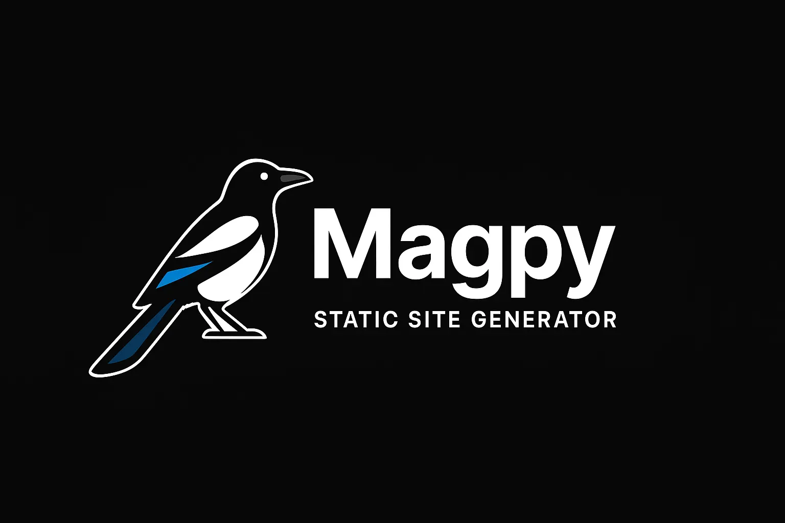

# 🪶 Magpy-SSG

**Magpy** is a lightweight, Python-based **Static Site Generator (SSG)** designed for simplicity, flexibility, and performance.  
It turns Markdown and TOML content into static HTML websites, with built-in support for modular sections (hero, gallery, testimonials, info-bar), Jinja2 templates, and optional integration with APIs such as reservation or booking systems.

---

## 🚀 Features

- 🧱 **Markdown-driven content** — one `.md` file per page
- ⚙️ **TOML configuration** — for global and per-page metadata
- 🧩 **Jinja2 templates** — reusable layouts and components
- 🖼️ **Hero, gallery, and info-bar support**
- 🌗 **Day/night themes** and mobile-first responsive design
- 🪶 **Simple Python CLI** to build, serve, and deploy your site
- 🔄 **Optional CMS & API integration**
- 📦 **Docker-ready**, with Caddy or Nginx reverse proxy support

---

## 📄 License

MIT License © 2025 — Created by moontommy  
Feel free to modify, distribute, or contribute!

---

## 🧠 Roadmap

- [ ] Plugin system for themes and filters
- [ ] Multilingual site support
- [ ] Admin UI for content editing
- [ ] GitHub Actions CI/CD
- [ ] Built-in Analytics

---

## 🪶 Magpy — static sites made simple.
